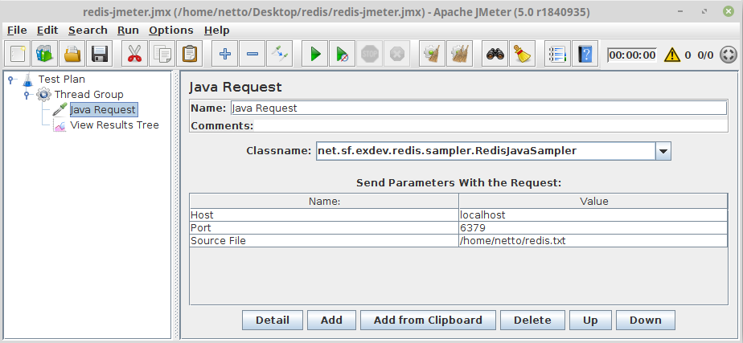

# Redis Sampler
JMeter sampler for Redis based on Jedis

# License
* [BSD License](LICENSE)

# Limitations
* The data mass for JMeter must specified directly at the Redis sampler (too lazy to RTFM/study JMeter code to implement it properly)
* All limitations from Jedis driver applies
* Only the following commands are supported at this time: append, set, get, delete, expire, flush

# TODO
* Complete commands
* Complete JMeter integration
* Refactoring as always
* Unit tests

# Setup
1. Compile code with maven:
```bash
netto@morpheus:~$ cd <redis.sampler directory>
netto@morpheus:~/Dropbox/repo/exdev/java/redis.sampler$ mvn package install
[INFO] Scanning for projects...
[INFO]                                                                         
[INFO] ------------------------------------------------------------------------
[INFO] Building redis.sampler 0.0.1-SNAPSHOT
[INFO] ------------------------------------------------------------------------
[INFO] 
[INFO] --- maven-clean-plugin:2.5:clean (default-clean) @ redis.sampler ---
[INFO] Deleting /home/netto/Dropbox/repo/exdev/java/redis.sampler/target
[INFO] 
[INFO] --- maven-resources-plugin:2.6:resources (default-resources) @ redis.sampler ---
[INFO] Using 'UTF-8' encoding to copy filtered resources.
[INFO] skip non existing resourceDirectory /home/netto/Dropbox/repo/exdev/java/redis.sampler/src/main/resources
[INFO] 
[INFO] --- maven-compiler-plugin:3.1:compile (default-compile) @ redis.sampler ---
[INFO] Changes detected - recompiling the module!
[INFO] Compiling 2 source files to /home/netto/Dropbox/repo/exdev/java/redis.sampler/target/classes
...
[INFO] 
[INFO] --- maven-install-plugin:2.4:install (default-install) @ redis.sampler ---
[INFO] Installing /home/netto/Dropbox/repo/exdev/java/redis.sampler/target/redis.sampler-0.0.1-SNAPSHOT.jar to /home/netto/.m2/repository/net/sf/exdev/redis.sampler/0.0.1-SNAPSHOT/redis.sampler-0.0.1-SNAPSHOT.jar
[INFO] Installing /home/netto/Dropbox/repo/exdev/java/redis.sampler/pom.xml to /home/netto/.m2/repository/net/sf/exdev/redis.sampler/0.0.1-SNAPSHOT/redis.sampler-0.0.1-SNAPSHOT.pom
[INFO] ------------------------------------------------------------------------
[INFO] BUILD SUCCESS
[INFO] ------------------------------------------------------------------------
[INFO] Total time: 1.997 s
[INFO] Finished at: 2018-12-26T11:44:43+01:00
[INFO] Final Memory: 35M/433M
[INFO] ------------------------------------------------------------------------

```

2. Copy jar to JMeter library directory:
```bash
netto@morpheus:~/Dropbox/repo/exdev/java/redis.sampler$ cp target/redis.sampler-0.0.1-SNAPSHOT.jar <jmeter.home>/lib/ext
```

# Usage
1. Add a Java Sampler as in the picture below:


2. Fill the parameters (host, port, source file)
   1. Host can be a string (e.g. localhost) or an ip (e.g. 172.243.65.5)
   2. Port can be an integer number between 1 and 65535, default is 11211
   3. Source File is the path of the file containing the data to be submitted, it must follow certain patterns as bellow:


Command | Argument 1 | Argument 2
------- | ---------- | ----------
append | key | value
set | key | value
get | key | -
delete | key | -
expire | key | seconds | -
flush | - | - | -

 All values from columns Command, Argument 1, Argument 2 must be string  
 All values from column Argument 3 must be an integer number

3. Play!!!